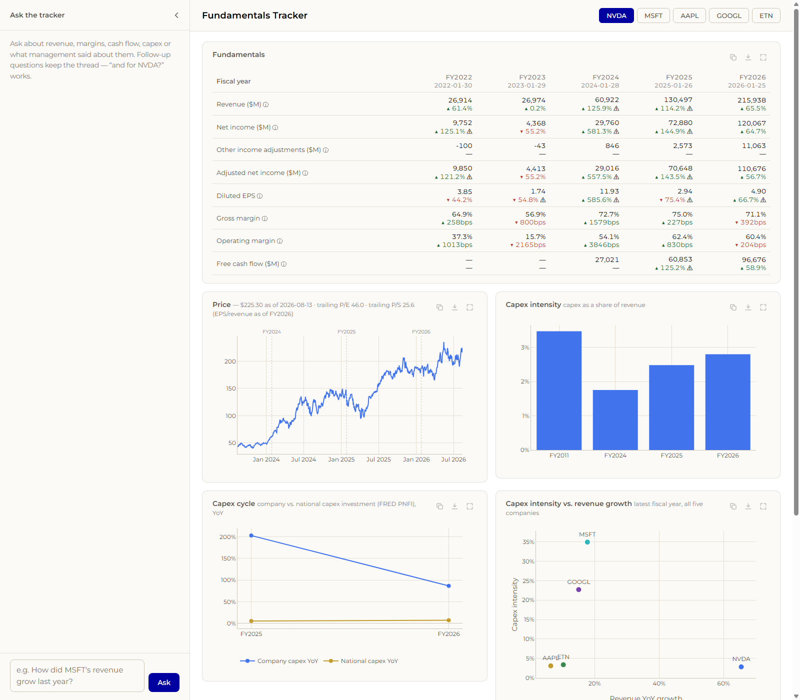
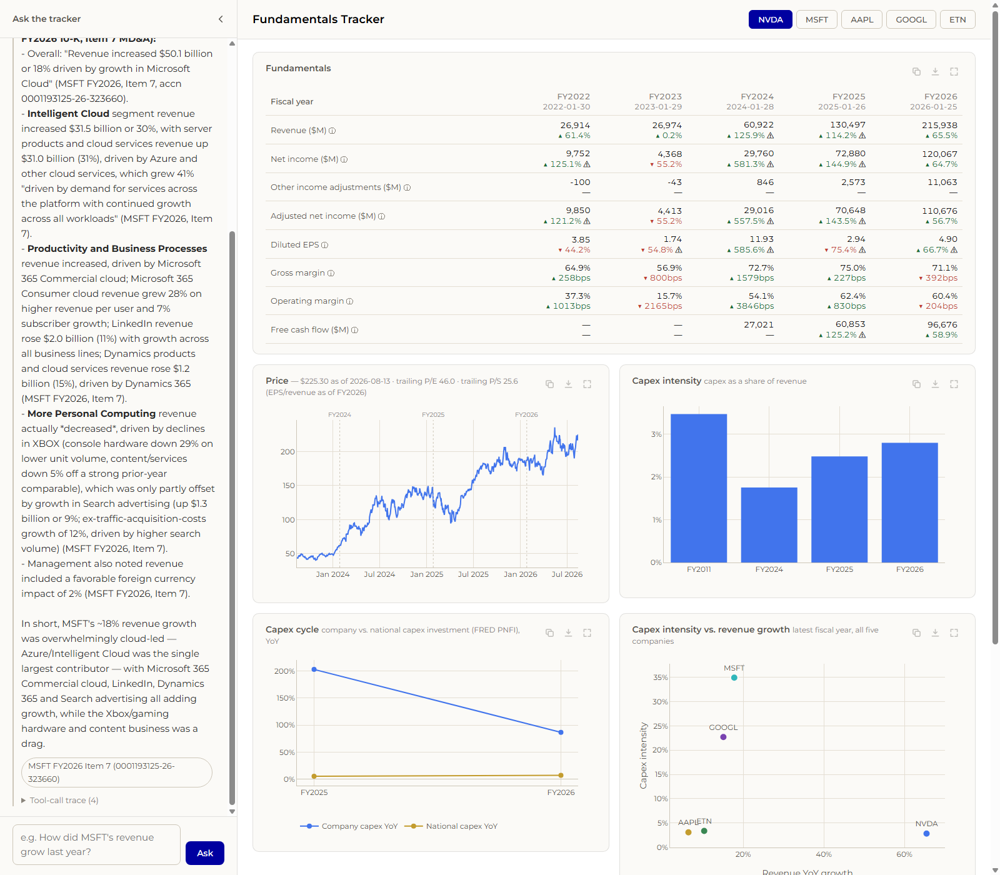

# Fundamentals Tracker

A dashboard that tracks fundamentals for NVDA, MSFT, AAPL, GOOGL, and ETN from SEC EDGAR (XBRL +
10-K narrative), Yahoo Finance, and FRED, and answers natural-language questions over both the
reported numbers and the filing text via a Claude tool-use agent.

See `PLAN.md` (pre-build scoping) and `DESIGN.md` (architecture writeup, cross-source join,
metric rationale, tradeoffs, cuts) for the full picture. This file is the run-it doc.

## Run it — one command

```bash
cp .env.example .env      # then set ANTHROPIC_API_KEY (see below)
docker compose up
```

Open **http://localhost:8000**. Postgres and the seed snapshot committed at `data/seed/*.csv.gz`
auto-load on first boot — the dashboard and Q&A layer work with **zero live network dependency**
for SEC/Yahoo/FRED. The only outbound call at request time is the chat rail's call to the
Anthropic API.

The dashboard is two columns: a collapsible chat rail on the left, and the charts and tables on
the right. Every chart and table is its own card with a hover toolbar — **copy** (chart to the
clipboard as a PNG, table as a pasteable grid), **download** (PNG/JPEG for charts, `.xlsx` with
typed numeric cells for tables, plus `.csv` of the full OHLCV series on the Price card) and
**fullscreen**.

To re-run **live** ingestion against the real sources (proves the wiring is real, not just the
seed):

```bash
docker compose exec app python -m tracker.ingest.run_all
docker compose exec db psql -U tracker -d tracker -c \
  "select source,status,row_count,started_at from ingest_runs order by started_at desc limit 10"
```

Run tests (needs the stack up, plus `ANTHROPIC_API_KEY` for the agent-routing tests):

```bash
docker compose exec app pytest
```

## Environment variables

| Var | Required | Purpose |
|---|---|---|
| `DATABASE_URL` | yes (has a working default in Compose) | Postgres connection string |
| `ANTHROPIC_API_KEY` | yes, for the Q&A layer | Anthropic API key |
| `ANTHROPIC_BASE_URL` | no | Point at a proxy instead of `api.anthropic.com` |
| `ANTHROPIC_MODEL` | no (default `claude-sonnet-5`) | Exact model to call |
| `SEC_USER_AGENT` | yes, for live ingestion | SEC requires a descriptive UA with real contact info |
| `FRED_API_KEY` | no | If unset, macro ingestion uses FRED's keyless CSV endpoint |
| `FLASK_PORT` | no (default `8000`) | App port |

All three LLM settings are env-driven and read nowhere else in the code — point
`ANTHROPIC_BASE_URL`/`ANTHROPIC_MODEL` at a grader-run proxy and it Just Works.

## Provider and model

**Anthropic**, model **`claude-sonnet-5`** (env-configurable, see above), via the official
`anthropic` Python SDK's `client.beta.messages.tool_runner` (tool-use agent loop, max 10
iterations). See `DESIGN.md` for why this shape and where the LLM is/isn't in the data path.

## Example interactions

**1. Company selector + fundamentals table + price chart (dashboard)**

Select a ticker (e.g. `MSFT`) from the top button row. The fundamentals table shows the last 5
fiscal years of revenue, net income, diluted EPS, gross margin, operating margin, and free cash
flow, each with a color-coded YoY delta (green ▲ / red ▼); a large-swing delta (e.g. an
EPS jump around a stock split) is additionally flagged with a "⚠" hover tooltip rather than
shown as a plain, misleading percentage. The price card plots ~3 years of daily closes
with dotted vertical markers at each fiscal-year-end date, so the price series lines up visually
with the reported periods.



**2. The "own metric" — Capex Cycle**

Three cards cover the capex story, per company: capex intensity (capex ÷ revenue) as a bar chart
by fiscal year, a line chart of that company's capex YoY growth against the national capex cycle
(FRED's Private Nonresidential Fixed Investment YoY growth), and a five-company scatter of latest
capex intensity vs. revenue growth. See `DESIGN.md` for what this is meant to tell an investor.

**3. Q&A — cross-modal (numbers + filing narrative)**

> **Q: How did MSFT's revenue grow last year, and what did management attribute it to?**
>
> MSFT revenue grew to **$331.839B in FY2026**, up **17.79% YoY** from FY2025's $281.724B (MSFT
> FY2026 vs FY2025, via `get_fundamentals`). The 10-K MD&A states this as an increase of "$50.1
> billion or 18%," **driven by growth in Microsoft Cloud** — Intelligent Cloud revenue grew 30%
> (Azure +41%), and Productivity and Business Processes grew 16% (Microsoft 365 Commercial cloud).
> More Personal Computing declined on Xbox/gaming weakness, partly offset by Search advertising
> growth. (MSFT FY2026 10-K, Item 7 MD&A, accession `0001193125-26-323660`.)

The tool-call trace under that answer shows both tools fired: `get_fundamentals` (the number) and
`search_filings` (the MD&A narrative), each with the raw tool result — the grounding audit trail.
The chat is multi-turn: the transcript is posted back with each question, so "and for NVDA?"
resolves against the previous answer.



**4. Q&A — out-of-scope, declined rather than invented**

> **Q: What is NVDA's forward guidance for next quarter?**
>
> I can't answer that. My dataset is trailing-only — reported historical financials, historical
> prices, historical macro data, and 10-K narrative text — but no forward guidance, analyst
> estimates, or price targets. I can instead show NVDA's recent revenue trend or management's
> discussion of recent results.

No tools were called for this question — the system prompt's out-of-scope rule fires before any
retrieval, exactly as intended.

## Repo layout

```
src/tracker/
  config.py          universe, FRED series IDs, env loading
  db/                schema.sql, connection helper
  ingest/            EDGAR facts/filings, prices, FRED, seed export/load, run_all orchestrator
  transform/         XBRL tag fallback chains, normalization, 10-K section parsing
  metrics/           pure reported/derived/valuation/capex functions + DB query layer
  ai/                the 5 tools, system prompt, agent loop
  web/               Flask app, API routes, dashboard templates/JS
tests/               pytest — concepts, metrics, sections, API smoke tests, agent routing
data/seed/           committed gzipped-CSV snapshot (auto-loaded by run.sh on an empty DB)
```

## Submission attestation

I have completed the following Schonfeld Case Study solely using publicly available sources of
information. Accordingly, I further confirm that I have not used any Material Non-Public
Information (within the meaning of U.S. federal securities laws) and information that is subject
to a duty or contractual restriction to a third party.
